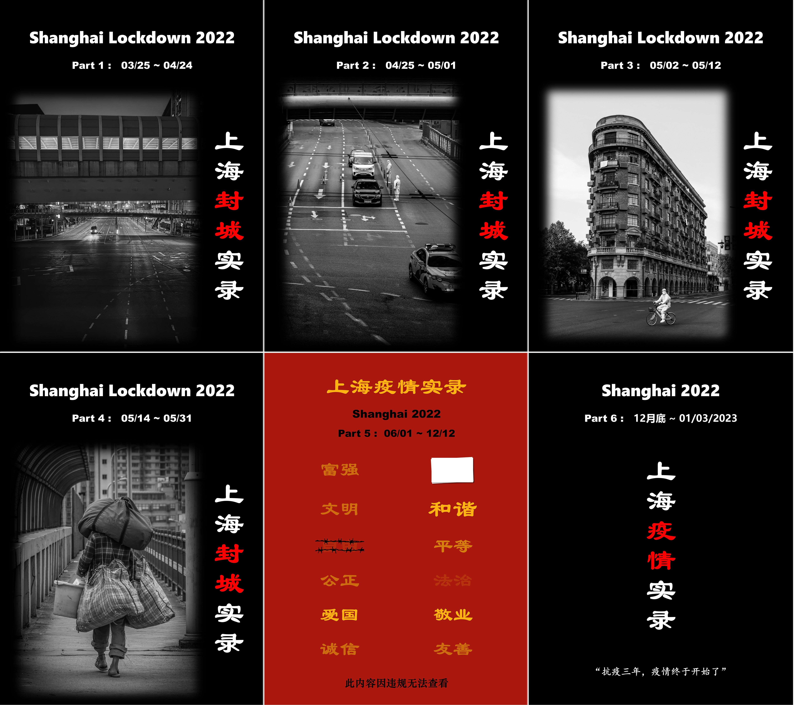
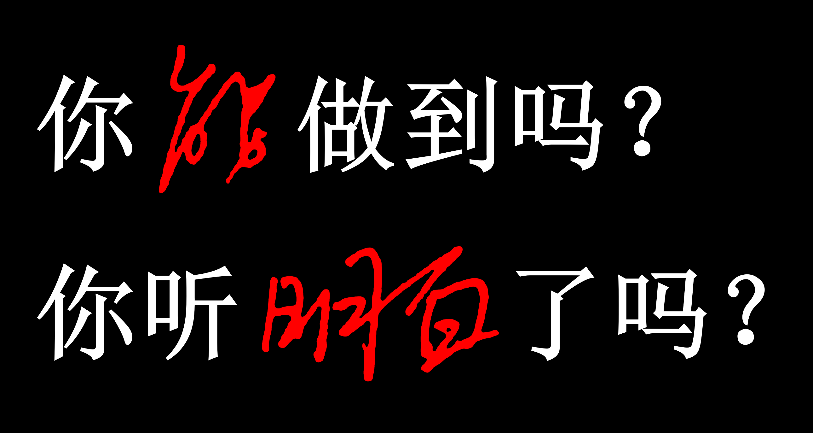

# Shanghai_2022_Album

**Shanghai404   01-03-2023**

 

记录上海封城 03/25/2022 ~ 05/31/2022。

记录上海乌鲁木齐中路上曾经人如潮涌。

记录上海一段特殊的历史。

---

PDF文档，字体与页面大小为手机屏幕优化，建议**使用手机浏览**。

全部相册完成于01/03/2023。

 

整个相册分**6部**：

1. **03/25 ~ 04/24**

   - 浦西封城前

   - 浦西封城

   - 三区划分

2. **04/25 ~ 05/01**

   - 从严管理（孙春兰）

   - 标准松动（社会面基本清零）

3. **05/02 ~ 05/12**

   - 提级管理

   - 静默期

4. **05/14 ~ 05/31**

   - 杨浦加强静默期

   - 分批解封（上）

   - 分批解封（下）

   - 解封前

5. **06/01 ~ 12/12**

   - 常态化管理

   - 乌鲁木齐中路抗议游行

   - 放弃清零政策

6. **12月底 ~ 01/03/2023**
   - 殡仪馆与医院

 

封城刚开始，外出行动尚处于试探摸索阶段，4月1日至4月24日期间只敢晚上出动，且以手机拍摄。

因此第1部相册中，内容以空旷的街道场景为主，较为单一。

后续2至4篇，照片大部分以佳能G5x MarkⅡ进行拍摄，画质提升，题材也丰富许多。

第5篇为常态化防控与乌鲁木齐中路抗议游行的一些内容。虽然没能参与，但是身在其中，照片描述文字中总会带些主观色彩。

如果反对我的观点，请仅关注照片本身。

 

---

曾经常常与外国人争论中国的事情，认为他们被政府与新闻媒体洗脑，认为他们没来过中国，有什么资格评论中国。而现在，很多发生在自己城市的事情，我们却只能非法“翻墙”从BBC，CNN，美国之音等外媒那里得知。

现在想想，或许之前是我们什么都不知道？ 33年前那个春夏交际时发生了些什么？ 19年香港到底是怎么一回事？ 国际上沸沸扬扬的新疆劳工究竟是真是假？

有些在国外近10年，我曾坚信不疑的“事实”，经过这大半年的亲身经历，我只能说我不知道。

“你如果希望了解你的祖国，你已经走上了犯罪的道路。”

 

---

2022年12月初，政府多日连发多条防控措施调整方案，最终在12月12日，彻底放弃了“绝不动摇”的“动态清零”政策。

 

新政策包括：

- 阳性，密接居家隔离（自愿）
- 不判定次密接，不封楼
- 不强制做核酸，不赋黄码
- 无阻碍跨省市，下线行程卡
- 除医院，学校等有特殊要求的场所，不查核酸不扫场所码

 

**毫无预兆**地突然放松所有管制，而药物储备，基础医疗建设却并未跟上，这大概算是真正的“躺平”了吧。

一切如同儿戏，一地鸡毛。

---

---

**以下摘录几句话**

 

> 如果天总也不亮，那就摸黑过生活；
>
> 如果发出声音是危险的，那就保持沉默；
>
> 如果自觉无力发光，那就别去照亮别人。
>
> 但是——但是：不要习惯了黑暗就为黑暗辩护；
>
> 不要为自己的苟且而得意洋洋；
>
> 不要嘲讽那些比自己更勇敢、更有热量的人们。
>
> 可以卑微如尘士，不可扭曲如蛆虫。

**—— 季业 06-04-2012微博**

---

> 做奴隶虽然不幸，但并不可怕，因为知道挣扎，毕竟还有挣脱的希望；
>
> 若是从奴隶生活中寻出美来，赞叹、陶醉，就是万劫不复的奴才了。
>

 

**—— 鲁迅 《南腔北调集·漫与》**

---

> \- "Why?"
>
> \- "Why? I Think It's My Duty."
>

 

**—— BBC纪录片 1989年6月北京，市民答记者问**

---

